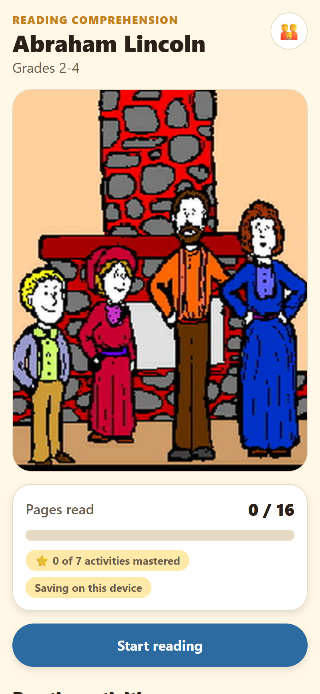
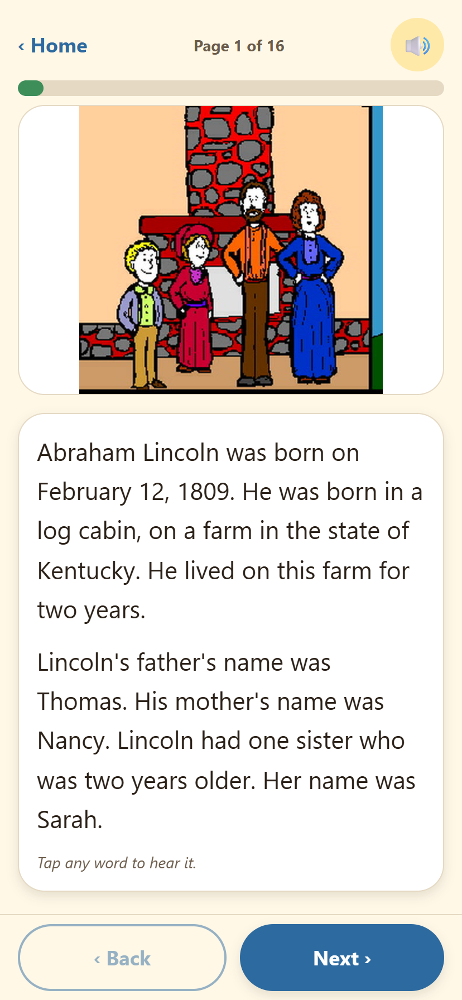
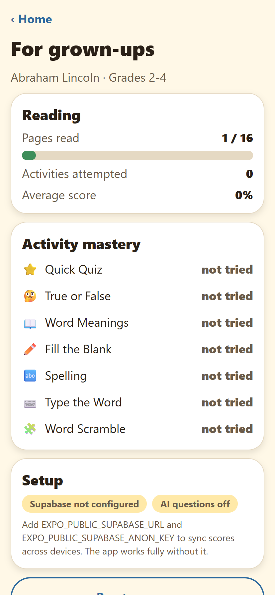

# Abe Reads 📖

A modern, kid-friendly reading-comprehension mobile app, rebuilt from a 1999
MetaCard/HyperCard-era educational program (*Reading Comprehension — Abraham
Lincoln, 420G*).

The original was a Windows-only `.exe` with a proprietary binary stack file. All
of its educational content has been recovered and rebuilt as a cross-platform
app for **iOS, Android and web**.

## What's inside

| | |
|---|---|
| **16** illustrated story pages | recovered artwork, 2× upscaled |
| **62** quiz questions | across 7 activity types |
| **754** words of story text | levelled for grades 2–4 |

| Home | Reader | Quiz | Grown-ups |
|---|---|---|---|
|  |  |  |  |

### Activities
- ⭐ **Quick Quiz** — multiple choice & true/false (16)
- 🤔 **True or False** (6)
- 📖 **Word Meanings** — vocabulary (6)
- ✏️ **Fill the Blank** (6)
- 🔤 **Spelling** (6)
- ⌨️ **Type the Word** — cloze, typed answers (16)
- 🧩 **Word Scramble** (6)
- ✨ **Bonus Questions** — generated fresh by an open AI model

### Built for young readers
- **Tap any word** in the story to hear it spoken
- **Read-aloud** for every page and every question (on-device TTS, works offline)
- Large touch targets (≥52pt), high contrast, screen-reader labels
- Encouraging feedback — never just "wrong"
- Instant answer checking with haptics
- A **grown-ups dashboard** showing mastery per activity and the questions missed most often

## Tech stack

Entirely open source:

- **[Expo](https://expo.dev) / React Native** — one codebase, iOS + Android + web
- **[expo-router](https://docs.expo.dev/router/introduction/)** — file-based navigation
- **[expo-speech](https://docs.expo.dev/versions/latest/sdk/speech/)** — offline text-to-speech
- **[Supabase](https://supabase.com)** — Postgres, anonymous auth, progress sync (optional)
- **[Hugging Face](https://huggingface.co)** — `Llama-3.1-8B-Instruct` for bonus questions (optional)
- **TypeScript** in strict mode

Both cloud services are **optional**. With no keys configured the app is fully
playable offline, storing progress on the device.

## Quick start

```bash
npm install
npm start          # then press i / a / w
```

| Command | What it does |
|---|---|
| `npm start` | Expo dev server |
| `npm run android` / `ios` / `web` | open on a platform |
| `npm run typecheck` | TypeScript, no emit |
| `npm run build:web` | static web bundle → `dist/` |

## Optional: progress sync (Supabase)

1. Create a project at [supabase.com](https://supabase.com).
2. Run [`supabase/schema.sql`](supabase/schema.sql) in the SQL editor. It creates
   `progress` and `quiz_results` with row-level security, plus a `quiz_summary`
   view for reporting.
3. Enable **anonymous sign-ins** (Authentication → Providers) so a child never
   needs an email address.
4. Add credentials to `.env`:

```bash
EXPO_PUBLIC_SUPABASE_URL=https://xxxx.supabase.co
EXPO_PUBLIC_SUPABASE_ANON_KEY=eyJ...
```

Results are queued locally when offline and flushed automatically on next
launch, so a dropped connection never loses a child's work.

## Optional: AI bonus questions (Hugging Face)

Get a free token at [huggingface.co/settings/tokens](https://huggingface.co/settings/tokens):

```bash
EXPO_PUBLIC_HF_TOKEN=hf_...
```

Questions are generated from the story text only, and any malformed item is
discarded rather than shown to a child. Swap the model in
`src/lib/huggingface.ts`.

## How the legacy content was recovered

The `.exe` turned out to be the **MetaCard 2.2 runtime** (© 1999 MetaCard
Corporation) — a HyperCard-like engine. The real content lived in `data.dat`, a
MetaCard 2.1 stack: a shell-script header followed by binary object records.

Text fields are stored as length-prefixed ASCII records marked by `0x0C 0x00`,
with a length byte and the string. Walking the file for that signature recovered
32 story paragraphs, all question fields and the answer keys. Record *gaps*
distinguish field boundaries (gap of 6) from continuation lines (gap of 1),
which is how paragraphs were reassembled.

The 8 JPEGs were each two-panel spreads; they were upscaled 2× (Lanczos) and
split down the middle into the 16 story pages, which align exactly with the
32 paragraphs — 2 paragraphs per panel.

Extracted content lives in [`src/content/lincoln.json`](src/content/lincoln.json).
Every cloze answer was programmatically verified to appear in its referenced
story page, and every scramble verified as a true anagram.

## Security note: `npm audit`

`npm audit` reports vulnerabilities in this project. They were investigated and
are **build-tooling only — none reach a user's device**:

- Every flagged package (`xcode`, `uuid@7`, `metro*`, `@expo/cli`,
  `@expo/config-plugins`, `image-size`) is a transitive dependency of the Expo
  CLI, used when *building* the app.
- The chain is `expo → @expo/config-plugins → xcode → uuid@7.0.3`. `xcode`
  writes iOS project files during prebuild and never executes at runtime.
- Verified against the built bundle: none of these appear in
  `dist/_expo/static/js/web/entry-*.js`. The only `metro` match is the literal
  string `"bundler":"metro"` in embedded app config.

**Do not run `npm audit fix --force`.** It "fixes" these by downgrading
Expo 57 → 53 and React Native 0.86 → 0.72 — four major versions backwards,
which breaks peer dependencies across 22 packages and ships *older* code. The
real fix arrives via normal Expo SDK upgrades.

## Adding another story

The app is content-driven. Drop a new JSON pack matching the `ContentPack` type
in `src/lib/content.ts`, add its page images to `src/lib/images.ts`, and the
whole UI — reader, activities, dashboard — works unchanged.

## Project layout

```
app/                    screens (expo-router)
  index.tsx             home: progress + activity menu
  read/[page].tsx       story reader, tap-to-hear
  quiz/[key].tsx        quiz host
  bonus.tsx             AI-generated questions
  grownups.tsx          parent/teacher dashboard
src/
  components/           QuizRunner, ScoreCard, UI kit
  content/lincoln.json  recovered content pack
  lib/                  content, theme, storage, supabase, huggingface, TTS
supabase/schema.sql     tables, RLS, reporting view
assets/story/           16 recovered story panels
```

## Credits

Educational text and illustrations originate from the *Reading Comprehension:
Abraham Lincoln* (420G) MetaCard stack. This project modernises that content for
current devices. Please confirm you hold the rights to the source material before
distributing publicly.

Code: MIT.
